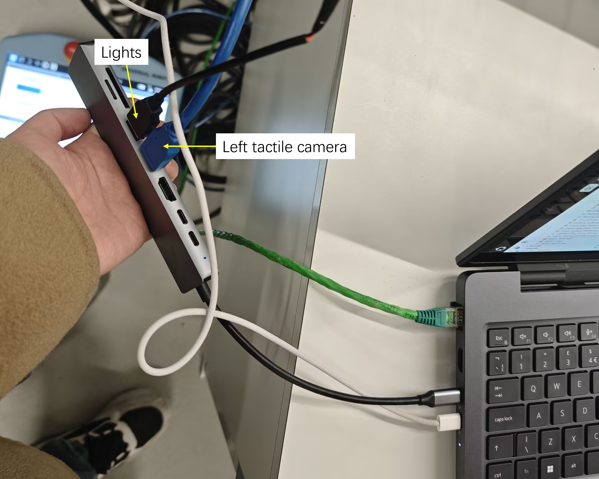

# Robot remote control with Meta Quest 3 (English version, Up-to-date)
Project page: https://github.com/Zhuochenn/teleUR?tab=readme-ov-file

Pull: tactile branch, not main branch

1. Realsense camera setting: Connect realsense camera to the laptop. Refer to Fig.1 for the correct port to use. Using a different port will result in input reading failure. (Out of date info: Run `realsense_show.py` to see the working camera ports, and run `markerless.py` to check the camera input from a specific port)
2. Tactile sensor camera setting: Connect the cameras to the laptop. Refer to Fig.1 and Fig. 2 for the correct ports to use. Using different ports will result in input reading failure. (Out of date info: Run `realsense_show.py` to see the working camera ports, and run `markerless.py` to check the camera input from a specific port)


Fig. 1


Fig. 2

3. UR5 launch: Press the button on the top of the robot control panel. Press the green button at the left bottom corner on the screen to start the robot. If you're going to use the parallel gripper, please also press the "UR+" button at the right top corner and allow gripper usage.
4. Network connection
   1. Set the robot IP address as 10.40.101.10. Set the expected host IP as 10.40.101.1. The IPs don't get changed often, but it's better to check them on the control panel before using.
   2. Connect the robot to the laptop with its network cable
      1. Set laptop (host) IP: Run `sudo ip addr add 10.40.101.1/24 dev enp132s0`
      2. Test connection: Run: `ping 10.40.101.10`. If the connection fails, you can re-insert the network cable (the physical connection could be unstable).
   3. Switch the robot control mode to 'Remote' on the panel.
5. Turn on Meta Quest headset: Press the white button on the left.
6. Launch nodes: Run `python launch_nodes.py` and keep it running.
7. Set up Meta Quest headset
   1. Wear the headset and press the `notification - usb detected` on the desktop with the VR controller, and allow debugging. Then select the Android-like icon at the bottom status bar, select the popped out window to enter.
   2. Target the VR controller to the black screen on the right. Press with your index finger. The controller is connected if you can feel the vibration.
   3. Put the headset upside down on the table. Press the controller again with your index finger to check if the connection is still effective.
8. Start robot control: Refer to `QUICK_START.md` for requirements for your own task.
   1. Example： Run `python run_env.py --save-data` in another terminal. If you see the following outputs, it means the VR controller doesn't have access, and you can kill the session, reset the headset and run the code again.
   Case 1:
```commandline
Device is visible but could not be accessed.
Run `adb devices` to verify that the device is visible and accessible. 
```
   Case 2:
```
Quest agent created
(1, 480, 640) uint16
```
9. Control the robot: When you press with your index finger and move the controller, the robot will move with you. Release the finger to unbind. 
10. Shut down the robot when you finish the experiment: Lift the robot end effector at a distance above the table to keep it safe. Press the "shut down" button at the up-right corner of the control panel. The end effector will shake a bit before shutting down so we need to lift it up.
11. Shut down the VR headset: Long-press the white button on the left until it shows "power off".

# Robot remote control with Meta Quest 3 (Chinese version)
项目地址：https://github.com/Zhuochenn/teleUR?tab=readme-ov-file

拉取branch版本：tactile，而不是main
1. Realsense相机配置：相机连接电脑（已废弃：运行`realsense_show.py`，查看端口，然后运行`markerless.py`查看各个端口的相机屏幕）
2. 找视触觉相机的端口：运行`cam_port.py`检测可用相机端口，运行`markerless.py`，指定端口查看画面
3. UR5启动：按控制板顶部开机按钮，点左下角开启，然后点start。如果已经安装平行夹爪，点右上角UR+，打开手。
4. 网络连接：
   1. robot ip address设置为：10.40.101.10（检查是否被修改），指定机器人的host ip（主机）: 10.40.101.1
   2. 笔记本插网线，
      1. 设置ip：`sudo ip addr add 10.40.101.1/24 dev enp132s0`
      2. 测试连接：`ping 10.40.101.10`，如果ping不通，可以插拔网线
   3. 机器人面板右上角选择remote模式
5. VR眼镜按左边圆点开机
6. 加载节点：运行`python launch_nodes.py`，不要关掉
7. 眼镜操作设置：
   1. 戴眼镜，点开主页的`notification - usb detected`，点击允许debugging，在主页选择底部状态栏的安卓图标，点击弹出窗口，进入
   2. 在屏幕按食指，感受到震动说明已连接
   3. 把眼镜倒放在桌上，手柄放在眼镜前面让它检测到，按下食指确认依然有震动
8. 开启机械臂控制：查看`QUICK_START.md`
   1. 例如：在不使用tactile且不保存数据时，直接运行机械臂控制：`python run_env.py --no-use-tactile`，如果看到下面的结果，说明VR眼镜没有获得权限，可以拔插一下眼镜重新设置。
```commandline
Device is visible but could not be accessed.
Run `adb devices` to verify that the device is visible and accessible. 
```
如果卡住，显示下面内容，可能是眼镜连接问题，重新连接后跑代码
```
Quest agent created
(1, 480, 640) uint16
```
9. 手柄控制：按住食指的时候移动手柄，机械臂会跟着动，松开时解绑
10. 机器人关机：按面板右上角shut down，注意机器人的手远离桌面，因为会抖一下
11. 眼镜关机：长按左边的圆点按钮，直到出现一个power off图标

# Data storage
Data is stored in `shared/data/bc_data` by default.